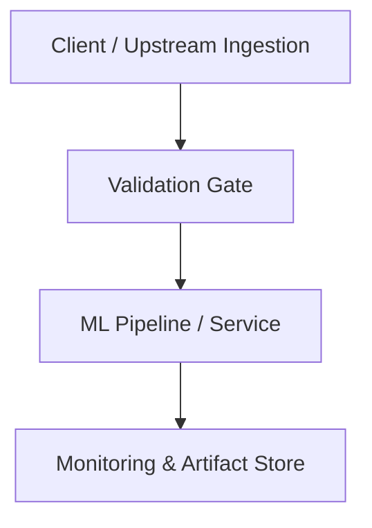

# Technical Architecture & Implementation Plan: [Feature Name]

## 1. System Architecture Overview
High-level component interaction and data flow diagram (Mermaid).

---

## 2. Technical Decisions & Trade-Offs

| Decision | Selected Option | Alternatives Considered | Rationale & Trade-offs |
| :--- | :--- | :--- | :--- |
| Framework / Tooling | ... | ... | ... |
| Data Storage / Format | ... | ... | ... |

---

## 3. Component Design & Module Breakdown
- **Module A (`path/to/module`)**: Responsibilities, interfaces, state management.
- **Module B (`path/to/module`)**: Responsibilities, interfaces, state management.

---

## 4. Testing & Validation Strategy
- **Unit Tests**: Coverage targets, mocking strategy, edge conditions.
- **Integration Tests**: End-to-end tests across modules.
- **Regression Tests**: Verification that existing baseline metrics and schemas do not degrade.
- **Performance / Benchmark Tests**: Latency and resource consumption benchmarks.

---

## 5. Security, Governance & Deployment Considerations
- Environment isolation & dependency pinning.
- Secret and credential handling.
- Rollback and failover strategy.
