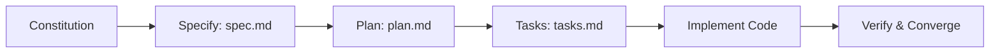

# Spec Kit (Spec-Driven Development) in this Repository

This repository follows the **Spec-Driven Development (SDD)** paradigm using [GitHub Spec Kit](https://github.com/github/spec-kit). Rather than unstructured prompt engineering ("vibe coding"), all new features, refactors, and architectural improvements are driven by structured, version-controlled Markdown artifacts.

---

## 📁 Directory Structure

```
.
├── .specify/                         # Spec Kit Framework & Rules
│   ├── memory/
│   │   └── constitution.md           # Immutable project rules & engineering standards
│   ├── templates/                    # Standardized templates for SDD phases
│   │   ├── spec-template.md          # Specification template (What & Why)
│   │   ├── plan-template.md          # Architecture & technical design template (How)
│   │   └── tasks-template.md         # Actionable checklist template (Execution)
│   └── specify.yaml                  # Spec Kit configuration
│
└── specs/                            # Feature Specifications
    ├── README.md                     # This navigation guide
    └── 001-production-mlops-hardening/
        ├── spec.md                   # Feature requirements, user stories, acceptance criteria
        ├── plan.md                   # System architecture, component diagrams, trade-offs
        └── tasks.md                  # Detailed implementation tasks & progress tracking
```

---

## 🔄 The SDD Lifecycle



1. **Constitution (`.specify/memory/constitution.md`)**: Defines non-negotiable boundaries (zero data leakage, financial net benefit optimization, calibrated probabilities, strict type hints, and SHA-256 artifact verification).
2. **Specify (`specs/<id>/spec.md`)**: Documents the problem, target personas, acceptance criteria, inputs, outputs, and edge cases.
3. **Plan (`specs/<id>/plan.md`)**: Lays out component diagrams, technical trade-offs, schemas, and testing strategy.
4. **Tasks (`specs/<id>/tasks.md`)**: Breaks down the plan into bite-sized, verifiable tasks with explicit file targets.
5. **Implement & Converge**: Code is developed strictly against the tasks and tested continuously until all acceptance criteria pass.

---

## 🚀 Active Specifications

- **[`001-production-mlops-hardening`](./001-production-mlops-hardening/)**: Production hardening covering FastAPI microservice serving, data drift detection (PSI/KS), containerization (Docker), GitHub Actions CI/CD, and developer task automation.
